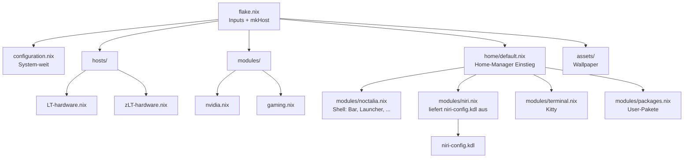

# NixOS Konfiguration mit Niri

Eine deklarative NixOS-Konfiguration mit dem Niri Wayland Compositor, der Noctalia-v5-Shell, Stylix Theming und Home-Manager.

## Verzeichnisstruktur



## Dateien im Detail

### `flake.nix`

Die Flake-Definition verwaltet alle externen Abhängigkeiten:

| Input | Beschreibung |
|-------|-------------|
| `nixpkgs` | NixOS Unstable Packages |
| `stylix` | System-weites Theming |
| `home-manager` | User-spezifische Konfiguration |
| `noctalia` | Noctalia v5 Wayland-Shell (Branch `cachix`) |

**Hosts:** `LT-nixos` und `zLT-nixos` (beide x86_64-linux)

Beide Hosts werden über den gemeinsamen Konstruktor `mkHost` erzeugt. Er nimmt
`hostName`, `hardware` und optionale `extraModules` entgegen; alles andere
(configuration.nix, nvidia.nix, Stylix, Home-Manager) ist für beide identisch.
`LT-nixos` bekommt zusätzlich `./modules/gaming.nix`, `zLT-nixos` nicht.

Weitere Besonderheiten:

- `specialArgs = { inherit inputs; }` und `home-manager.extraSpecialArgs` reichen
  die Flake-Inputs an alle Module durch.
- `home-manager.sharedModules = [ noctalia.homeModules.default ]` stellt
  `programs.noctalia.*` bereit (Flake-Output heißt `homeModules`, nicht
  `homeManagerModules`).
- Der Noctalia-Input bekommt bewusst **kein** `inputs.nixpkgs.follows`. Ein
  Override würde den Derivation-Hash ändern und damit jeden Treffer im
  Binary-Cache `noctalia.cachix.org` zunichte machen — Noctalia v5 müsste dann
  lokal (meson/C++, ca. 20 Minuten) gebaut werden.

---

### `configuration.nix`

Die zentrale System-Konfiguration. Hier wird alles definiert, was **root-Rechte** braucht oder **system-weit** gilt.

| Bereich | Einstellung |
|---------|-------------|
| **Boot** | systemd-boot, EFI |
| **Netzwerk** | NetworkManager, Firewall deaktiviert |
| **SSH** | OpenSSH aktiviert, Root-Login verboten, fail2ban |
| **Zeitzone** | Europe/Berlin |
| **Locale** | en_US.UTF-8 (System), de_DE.UTF-8 (Formate) |
| **Tastatur** | Deutsches Layout (de) |
| **Benutzer** | `jean` (wheel, networkmanager) |
| **Nix** | Flakes und nix-command aktiviert, unfree erlaubt, Noctalia-Cachix als `extra-substituters` |

**System-Programme:**

- `niri` - Wayland Tiling Compositor
- `git`, `neovim`, `xwayland-satellite`
- Bluetooth (blueman) aktiviert
- fwupd (Firmware-Updates)

**Laufzeit-Anforderungen von Noctalia (System-Ebene):**

| Dienst | Wofür |
|--------|-------|
| `services.pipewire` (+ `security.rtkit`) | Lautstärke-OSD, Privacy-Indikator, Spektrum-Widget. Braucht einen laufenden Daemon, WirePlumber ≥ 0.5 |
| `security.polkit.enable` | Voraussetzung für Noctalias eigenen Polkit-Agenten |
| `services.upower.enable` | Ohne UPower erscheint das Batterie-Widget gar nicht |
| `services.gnome.gnome-keyring` | Secret-Service-Provider für verschlüsselte Clipboard-History und Kalender-Zugangsdaten; Unlock hängt an `security.pam.services.login.enableGnomeKeyring` |

Bewusst **nicht** gesetzt: mako/dunst/swaync oder ein zweiter
StatusNotifier-Host — Noctalia beansprucht `org.freedesktop.Notifications` und
`org.kde.StatusNotifierWatcher` selbst. Der frühere Eintrag
`security.pam.services.swaylock` ist entfallen; Noctalias Sperrbildschirm
authentifiziert über den ohnehin vorhandenen PAM-Dienst `login`.

**Stylix Theming:**
- Theme: Catppuccin Mocha
- Font: JetBrainsMono Nerd Font
- Cursor: Catppuccin Mocha Dark
- Wallpaper: `assets/NixOS_Black_Sun.png`

---

### `hosts/LT-hardware.nix`, `hosts/zLT-hardware.nix`

Auto-generierte Hardware-Konfigurationen (via `nixos-generate-config`). **Nicht manuell bearbeiten!**

- Kernel-Module: `xhci_pci`, `ahci`/`thunderbolt`/`vmd`, `nvme`, `kvm-intel`
- Dateisysteme: `/` (ext4), `/boot` (vfat)
- Swap-Partition aktiviert
- Intel CPU Microcode Updates

---

### `modules/nvidia.nix`

NVIDIA Grafiktreiber-Konfiguration:

| Option | Wert | Beschreibung |
|--------|------|-------------|
| `videoDrivers` | nvidia | Proprietärer NVIDIA Treiber |
| `modesetting` | true | Kernel Mode Setting |
| `powerManagement` | true | Stromsparen aktiviert |
| `open` | false | Proprietär (nicht open-source) |
| `nvidiaSettings` | true | nvidia-settings GUI |

Hinweis: Das Modul steckt in `mkHost` in der gemeinsamen Modulliste und ist
damit auf **beiden** Hosts aktiv.

---

### `modules/gaming.nix`

Gaming-Konfiguration mit Steam und weiteren Tools (nur `LT-nixos`):

| Komponente | Beschreibung |
| ---------- | ------------ |
| **Steam** | Mit Remote Play und Dedicated Server Ports |
| **GameMode** | Automatische Performance-Optimierung |
| **Heroic** | Epic Games, GOG, Amazon Games Launcher |
| **Lutris** | Wine Gaming Platform |
| **MangoHud** | FPS Overlay & Performance Monitoring |
| **ProtonUp-Qt** | Proton/Wine Version Manager |
| **Sonstiges** | qbittorrent, protonvpn-gui |

---

### `home/default.nix`

Einstiegspunkt für Home-Manager (User `jean`). Die Datei enthält selbst nur die
Grundeinstellungen und bindet über `imports` die Fachmodule aus `home/modules/`
ein. `flake.nix` lädt sie über `home-manager.users.jean = import ./home;`.

**Session-Variablen:**
```nix
NIXOS_OZONE_WL = "1"    # Wayland für Electron Apps
GTK_THEME = "Adwaita:dark"
TERMINAL = "kitty"
```

`home.stateVersion` bleibt bewusst auf `"25.05"` — sie beschreibt, gegen welche
Home-Manager-Defaults die Konfiguration geschrieben wurde, und darf nicht
einfach hochgezogen werden.

---

### `home/modules/noctalia.nix`

Die komplette Noctalia-v5-Konfiguration (siehe eigener Abschnitt
[Noctalia](#noctalia) weiter unten) plus das Cheatsheet-Plugin.

---

### `home/modules/terminal.nix`

Aktiviert Kitty. Schrift, Schriftgröße, Farbschema und Transparenz kommen
vollständig aus dem Stylix-Kitty-Target; eigene Werte hier würden kollidieren.

---

### `home/modules/packages.nix`

**Installierte Pakete:**

| Kategorie | Pakete |
|-----------|--------|
| **Browser** | Brave (Wayland) |
| **Terminal** | kitty, alacritty |
| **CLI Tools** | fastfetch, btop, ripgrep, fd, lazygit, unzip, xxd, impala |
| **Wayland** | xdg-desktop-portal-gtk, xdg-desktop-portal-gnome, udiskie |
| **Entwicklung** | nodejs, gcc, go, python315 |
| **Apps** | localsend, pavucontrol, networkmanagerapplet, krita, aseprite, discord, spotify |

Entfallen gegenüber dem Waybar-Setup: `waybar`, `wlogout`, `swaylock(-effects)`,
`fuzzel`, `mako`, `swww`, `waypaper`, `swayidle`. Diese Funktionen bringt
Noctalia jetzt selbst mit; ein Parallelbetrieb wäre sogar schädlich.

---

### `home/modules/niri.nix`

Reicht `home/niri-config.kdl` unverändert als
`xdg.configFile."niri/config.kdl"` durch. Die KDL-Datei wird bewusst nicht aus
Nix generiert, damit sie mit der Upstream-Doku vergleichbar bleibt.

---

### `home/niri-config.kdl`

Niri Window Manager Konfiguration (KDL Format).

**Input:**
- Touchpad: Tap-to-Click, Natural Scroll
- Focus follows Mouse

**Layout:**
- Gaps: 10px
- Default Column Width: 50%
- Preset Widths: 33%, 50%, 66%
- Focus Ring: 2px, blau (#7fc8ff)

**Startup-Programme:**
```
noctalia, xwayland-satellite
```

**Wichtige Keybindings:**

| Tastenkombination | Aktion |
|-------------------|--------|
| `Mod+T` | Terminal (Kitty) |
| `Mod+Space` | App-Launcher (Noctalia) |
| `Mod+Q` | Fenster schließen |
| `Mod+F` | Maximieren |
| `Mod+Shift+F` | Fullscreen |
| `Mod+O` | Overview |
| `Mod+1-9` | Workspace wechseln |
| `Mod+H/J/K/L` | Fokus ändern (vim-style) |
| `Mod+Ctrl+H/J/K/L` | Fenster verschieben |
| `Mod+Shift+E` | Niri beenden |
| `Super+Shift+B` | Browser öffnen |
| `Print` | Screenshot |

**Noctalia-Keybindings:**

| Tastenkombination | Aktion | Kommando |
|-------------------|--------|----------|
| `Mod+Space` | Launcher | `noctalia msg panel-toggle launcher` |
| `Super+Alt+L` | Bildschirm sperren | `noctalia msg session lock` |
| `Mod+X` | Sitzungs-/Power-Menü | `noctalia msg panel-toggle session` |
| `Mod+N` | Control Center | `noctalia msg panel-toggle control-center` |
| `Mod+Ctrl+V` | Zwischenablage-Verlauf | `noctalia msg panel-toggle clipboard` |
| `Mod+P` | Hintergrundbild auswählen | `noctalia msg panel-toggle wallpaper` |
| `Mod+F1` | Tastenkürzel-Spickzettel | `noctalia msg panel-toggle kenn/keybind-cheatsheet:cheatsheet` |
| `Mod+Shift+F1` | Spickzettel neu einlesen | `noctalia msg plugin kenn/keybind-cheatsheet:data all refresh` |
| `Mod+Alt+K` | niri Hotkey-Overlay (Fallback) | `show-hotkey-overlay` |

`Mod+V`/`Mod+Shift+V` sind durch die Floating-Aktionen belegt, deshalb liegt die
Zwischenablage auf `Mod+Ctrl+V`. Lautstärke-, Mikrofon-, Medien- und
Helligkeitstasten bleiben bewusst direkt auf `wpctl`/`playerctl`/`brightnessctl`
— Noctalias OSD zeigt die Änderung trotzdem an, die Hardwaretasten funktionieren
aber auch, wenn Noctalia gerade nicht läuft.

**Window Rules:**
- Kitty: 90% Transparenz
- Brave: 95% Transparenz
- Inaktive Fenster: 85% Transparenz
- Picture-in-Picture: Floating
- `dev.noctalia.Noctalia` (Einstellungsfenster): Floating, 1080x920

**Layer Rules (Noctalia):**
- global `blur { passes 2; offset 3.0; noise 0.03; saturation 1.0 }`
- `^noctalia-(bar-.+|dock|panel|attached-panel|osd)$`: `background-effect { xray false }`
- `^noctalia-window-switcher$`: `background-effect { blur true; xray false }`
- `^noctalia-notification`: `block-out-from "screencast"`
- `^noctalia-backdrop`: `place-within-backdrop true` (Hintergrundbild bleibt in der Overview sichtbar)

`notification` fehlt in der Blur-Aufzählung bewusst: laut
[noctalia#2948](https://github.com/noctalia-dev/noctalia/issues/2948) bleibt der
Blur-Fleck stehen, wenn man eine Benachrichtigung vor Ablauf des Timeouts
wegklickt.

Namespaces zur Kontrolle: `niri msg layers`.

> **niri ≥ 26.04 erforderlich.** `background-effect` und der globale
> `blur`-Block gibt es erst ab niri 26.04 (Release 25.04.2026). Ein älterer
> Compositor bricht mit `x unexpected node 'background-effect'` ab und behält
> die zuletzt gültige Konfiguration. Dann den globalen `blur`-Block und die
> beiden `background-effect`-Regeln in `home/niri-config.kdl` mit `/-` davor
> auskommentieren. `place-within-backdrop` und `block-out-from` laufen schon ab
> 25.05 bzw. 25.02 und können bleiben.

> **Stolperfalle nach einem niri-Upgrade.** `nixos-rebuild switch` ersetzt das
> niri-Binary, **nicht** den laufenden Compositor-Prozess. Die alte Session
> liest die neue `config.kdl` per Hot-Reload trotzdem ein — und lehnt sie mit
> genau obigem Fehler ab, obwohl das neue Binary die Syntax könnte. Abhilfe:
> einmal ab- und wieder anmelden. Zum Unterscheiden:
>
> ```bash
> niri --version     # Binary auf PATH
> niri msg version   # tatsaechlich laufender Prozess
> ```
>
> Weichen die beiden ab, ist es genau dieser Fall.

**Debug:**
```kdl
debug {
    honor-xdg-activation-with-invalid-serial
}
```
Noctalia löst Fensteraktivierung teils ohne gültiges Serial aus (z. B. Klick auf
eine Benachrichtigungsaktion). Ohne diese Zeile ignoriert niri solche Anfragen.

---

## Noctalia

Noctalia ist die komplette Wayland-Shell und ersetzt den bisherigen Stack
vollständig:

| Früher | Jetzt |
|--------|-------|
| Waybar | Noctalia Bar (`[bar.main]`) |
| Fuzzel | Noctalia Launcher |
| mako | Noctalia Notification-Daemon |
| swaylock-effects | Noctalia Lockscreen (PAM) |
| wlogout | Noctalia Session-Panel |
| swww + waypaper | Noctalia Wallpaper |
| swayidle | Noctalia Idle |
| — | Clipboard-Verlauf, OSD, Polkit-Agent, Tray |

### Version: v5, nicht v4

Diese Konfiguration nutzt **Noctalia v5 — die native C++-Shell**. Das ist
**nicht** das ältere quickshell-basierte v4.

> **Wichtig bei der Recherche:** Die meisten Suchtreffer und Blogposts zeigen
> weiterhin v4. Alles, was dort steht, gilt hier **nicht**:
> - v4-IPC (`noctalia-shell ipc call …`) → v5 nutzt `noctalia msg …`
> - v4-Einstellungen im JSON-Format → v5 nutzt TOML

### Konfiguration

Die Laufzeitkonfiguration liegt in `~/.config/noctalia/config.toml` und wird
deklarativ aus `home/modules/noctalia.nix` erzeugt (`programs.noctalia.settings`).
`validateConfig = true` lässt `noctalia config validate` schon zur Bauzeit
laufen, damit Schema-Fehler nicht erst in einer kaputten Session auffallen.

Gestartet wird Noctalia über `spawn-at-startup "noctalia"` in
`home/niri-config.kdl`, **nicht** über eine systemd-Unit (`systemd.enable = false`).

Wesentliche Einstellungen:

| Bereich | Wert |
|---------|------|
| Bar | oben, 32 px, `capsule`, `background_opacity = 0.85`, volle Breite, Platz reserviert |
| Bar links / mitte | `workspaces` / `clock` |
| Bar rechts | `tray`, `notifications`, `volume`, `network`, `bluetooth`, `battery`, `power_profile`, `control-center`, `session` |
| Notifications | Daemon aktiv |
| OSD | oben rechts |
| Lockscreen | aktiv, `blurred_desktop`, Blur 0.5 / Tint 0.3 |
| Idle | Timeouts gesetzt (600 s / 660 s), aber **deaktiviert** |
| Wallpaper | aktiv, `fill_mode = "crop"`, Bild identisch zu `stylix.image` |
| Polkit-Agent | aktiv (deshalb darf kein zweiter Agent laufen) |
| Telemetrie | aus |

> **Der Bar-Name ist der Layer-Namespace.** `[bar.main]` erzeugt den
> Layer-Shell-Namespace `noctalia-bar-main`. Die `layer-rule` in
> `home/niri-config.kdl` matcht genau darauf — Umbenennen bricht die Regel.

### Footgun: Laufzeit-Overrides schlagen die Nix-Konfiguration

Ändert man etwas in Noctalias **GUI**, schreibt die Shell den Wert nach

```
~/.local/state/noctalia/settings.toml
```

Diese Datei **gewinnt gegenüber** der von Nix erzeugten
`~/.config/noctalia/config.toml`.

Wenn eine deklarative Änderung nach `nixos-rebuild switch` also **keine Wirkung**
zeigt: zuerst diese Datei löschen und Noctalia neu starten.

```bash
rm ~/.local/state/noctalia/settings.toml
```

Das ist die mit Abstand häufigste Ursache für „das Nix-Setting wird ignoriert".

### Cheatsheet-Plugin

Das Plugin `kenn/keybind-cheatsheet` stammt aus dem Repo
`noctalia-dev/community-plugins` und ist in `home/modules/noctalia.nix` per
`fetchFromGitHub` auf einen **festen Commit gepinnt**. Es wird über
`xdg.dataFile` nach

```
~/.local/share/noctalia/plugins/keybind-cheatsheet/
```

gelegt — ins **Daten**-, nicht ins Config-Verzeichnis. Noctalia scannt dort nur
**eine** Verzeichnisebene tief, das Layout muss also flach sein. Aktiviert wird
das Plugin über seine Manifest-ID in `plugins.enabled`, nicht über den
Verzeichnisnamen. Automatisches Nachladen aus dem Netz ist abgeschaltet
(`auto_update = false`, beide Default-Quellen `enabled = false`).

`Mod+Shift+F1` existiert, weil das Plugin `~/.config/niri/config.kdl` genau
**einmal beim Laden** einliest und keinen Datei-Watcher hat. Dieser Pfad ist bei
uns ein schreibgeschützter Symlink in den Nix-Store, den jedes
`nixos-rebuild switch` unter dem laufenden Plugin austauscht — deshalb nach
jedem Rebuild einmal manuell neu einlesen.

---

## Verwendung

### System bauen und aktivieren

```bash
# Beim ersten Mal oder nach Änderungen an flake.nix
sudo nixos-rebuild switch --flake .#LT-nixos

# Nur Konfiguration testen (ohne zu aktivieren)
sudo nixos-rebuild test --flake .#LT-nixos

# Flake aktualisieren
nix flake update
```

### Neues NixOS-Modul hinzufügen

1. Datei in `modules/` erstellen
2. In `flake.nix` einbinden:
   - für **beide** Hosts: in die Modulliste innerhalb von `mkHost`
   - nur für **einen** Host: in dessen `extraModules` (wie `./modules/gaming.nix`
     bei `LT-nixos`)

### Neues Home-Manager-Modul hinzufügen

1. Datei in `home/modules/` erstellen (ganz normales HM-Modul mit der Signatur
   `{ config, pkgs, lib, ... }:`)
2. In `home/default.nix` unter `imports` eintragen

### Neues Paket hinzufügen

- **System-weit:** In `configuration.nix` unter `environment.systemPackages`
- **User-spezifisch:** In `home/modules/packages.nix` unter `home.packages`

---

## Migration / Erste Schritte

Ablauf für den ersten Build nach dem Umstieg von Waybar auf Noctalia v5.

### 1. Flake aktualisieren (Pflicht)

```bash
nix flake update
```

Notwendig aus zwei Gründen:

- `noctalia` ist ein **neuer Input** und muss in `flake.lock`. Nix trägt einen
  fehlenden Input zwar beim Bauen selbst nach — aber eben nur den neuen.
- Der Lock ist rund ein halbes Jahr alt. Für die `background-effect`-Layer-Rules
  wird **niri ≥ 26.04** gebraucht (siehe oben).

> **Nicht `nixos-rebuild --upgrade` verwenden.** Das aktualisiert die alten
> Channels und hat auf ein Flake-System keinerlei Wirkung. Inputs werden
> ausschließlich über `nix flake update` (alle) bzw.
> `nix flake update <input>` (einzeln) aktualisiert.

Ob das Update gegriffen hat, sieht man am Generationsnamen nach dem Bauen:
`nixos-system-LT-nixos-26.05.<DATUM>.<rev>` — steht dort noch ein altes Datum,
lief der Build gegen den alten Lock.

### 2. Bauen

```bash
sudo nixos-rebuild switch --flake .#LT-nixos
# bzw. auf dem anderen Gerät:
sudo nixos-rebuild switch --flake .#zLT-nixos
```

### 3. Verifizieren

```bash
# Bar sichtbar? Layer-Namespace prüfen:
niri msg layers        # muss "noctalia-bar-main" auflisten

# Benachrichtigung testen:
notify-send "Test" "Noctalia laeuft"
```

Checkliste:

- [ ] Die Leiste erscheint oben
- [ ] `niri msg layers` listet `noctalia-bar-main`
- [ ] Benachrichtigungen erscheinen
- [ ] `Mod+Space` öffnet den Launcher
- [ ] `Mod+F1` öffnet den Spickzettel
- [ ] `Super+Alt+L` sperrt den Bildschirm

Wenn eine deklarative Einstellung wirkungslos bleibt: siehe
[Footgun-Abschnitt](#footgun-laufzeit-overrides-schlagen-die-nix-konfiguration)
— `~/.local/state/noctalia/settings.toml` löschen.

### 4. Rollback

```bash
# Konfigurationsstand zurücknehmen
git revert <commit>
# oder
git checkout <alter-commit> -- .

# Laufendes System auf die vorige Generation zurücksetzen
sudo nixos-rebuild switch --rollback
```

Notfalls im Boot-Menü eine ältere NixOS-Generation auswählen — die alte
Waybar-Generation bleibt dort verfügbar, bis sie per `nix-collect-garbage`
entfernt wird.

---

## Theming

Das Theming wird komplett über **Stylix** gesteuert. Stylix bleibt die einzige
Quelle der Wahrheit. Änderungen in `configuration.nix`:

```nix
stylix = {
  base16Scheme = "${pkgs.base16-schemes}/share/themes/THEME_NAME.yaml";
  image = ./assets/WALLPAPER.png;
  polarity = "dark";  # oder "light"
};
```

Verfügbare Themes: [base16-schemes](https://github.com/tinted-theming/base16-schemes)

### Noctalia und Stylix

Noctalia bringt eine eigene Theming-Maschinerie mit: Built-in-Paletten,
Community-Paletten, wallpaper-basiertes matugen-Theming und eine
Template-Engine, die App-Konfigurationsdateien zur **Laufzeit** schreibt.

Diese Engine ist bewusst **komplett abgeschaltet**:

```nix
enable_builtin_templates   = false;
builtin_ids                = [ ];
enable_community_templates = false;
community_ids              = [ ];
```

Grund ist ein konkreter Konflikt: Stylix schreibt App-Theme-Dateien zur
**Bauzeit** als schreibgeschützte Symlinks in den Nix-Store (z. B.
`~/.config/kitty/…`). Noctalias Template-Engine würde exakt dieselben Dateien
zur Laufzeit überschreiben wollen. Das schlägt entweder fehl (der Store ist
read-only) oder zerstört den deklarativen Zustand.

Die Brücke zwischen beiden Systemen baut **Stylix selbst**: seit Mitte 2026 gibt
es ein Noctalia-Target (`stylix/modules/noctalia/hm.nix`). Es leitet aus dem
base16-Schema ab:

| Noctalia-Einstellung | Quelle in Stylix |
|---|---|
| `theme.source = "custom"`, `theme.custom_palette = "stylix"` | fest |
| `customPalettes.stylix.dark` (16 Material-Rollen + Terminal-Block) | `base16Scheme` |
| `theme.mode` | `polarity` |
| `shell.font_family` | `fonts.sansSerif.name` |
| `wallpaper.default.path` | `image` |
| `dock` / `notification` / `osd` `.background_opacity` | `opacity` |

Deshalb setzt `home/modules/noctalia.nix` **nichts davon** selbst — jede eigene
Definition würde mit dem Target kollidieren (`conflicting definition values`).

Eine Ausnahme: `shell.font_family` steht auf `lib.mkForce "JetBrainsMono Nerd
Font"`. `stylix.fonts.sansSerif` ist hier nicht gesetzt, das Target würde also
den Default „DejaVu Sans" eintragen — ohne Nerd-Font-Glyphen. Wer das sauberer
will, setzt stattdessen `stylix.fonts.sansSerif` in `configuration.nix` und
entfernt das `mkForce`.

Abschalten liesse sich das Target über `stylix.targets.noctalia.enable = false`.

Wird das base16-Schema in `configuration.nix` getauscht, wandert die Änderung
automatisch bis in die Shell mit.

---

## Neues Gerät onboarden (Schritt für Schritt)

### 1. NixOS auf dem neuen Gerät installieren

```bash
# NixOS ISO booten und Partitionen erstellen
# Dann NixOS minimal installieren:
sudo nixos-install
```

### 2. Repository klonen

```bash
# Nach dem ersten Boot ins neue System:
nix-shell -p git

# Repository klonen
git clone https://github.com/DEIN_USER/nixos-niri.git ~/nixos-config
cd ~/nixos-config
```

### 3. Hardware-Konfiguration generieren

```bash
# Generiert hardware-configuration.nix für das neue Gerät
sudo nixos-generate-config --show-hardware-config > hosts/NEUER-HOST-hardware.nix
```

### 4. Host in `flake.nix` hinzufügen

Es wird **kein** kompletter `nixosConfigurations.<name>`-Block mehr kopiert.
Stattdessen kommt ein neuer Aufruf des `mkHost`-Konstruktors in den
`nixosConfigurations`-Block:

```nix
nixosConfigurations = {
  # ... bestehende Hosts ...

  NEUER-HOST = mkHost {
    hostName = "NEUER-HOST";
    hardware = ./hosts/NEUER-HOST-hardware.nix;

    # Nur host-spezifische Zusatzmodule, alles Gemeinsame steckt in mkHost:
    extraModules = [ ./modules/gaming.nix ];
  };
};
```

`mkHost` bindet für jeden Host automatisch ein: `configuration.nix`, die
Hardware-Datei, `modules/nvidia.nix`, Stylix, den Hostnamen sowie Home-Manager
inklusive Noctalia-Modul und `home/default.nix`.

Alles, was auf **allen** Hosts gelten soll, gehört in die Modulliste **innerhalb**
von `mkHost` — nicht in `extraModules`. Das ist genau der Grund für den
Konstruktor: Änderungen können nicht mehr versehentlich nur in einem Host landen.

### 5. Hardware-spezifische Anpassungen

Je nach Hardware musst du Module anpassen:

| Hardware | Aktion |
| -------- | ------ |
| **NVIDIA GPU** | Nichts zu tun — `./modules/nvidia.nix` steckt bereits in `mkHost` |
| **AMD GPU** | `./modules/nvidia.nix` aus `mkHost` herausziehen und in die `extraModules` der NVIDIA-Hosts verschieben; ggf. `modules/amd.nix` anlegen (mesa reicht meist) |
| **Intel GPU** | Wie AMD: nvidia.nix aus der gemeinsamen Liste nehmen |
| **Laptop** | Batterie/Power-Management ist bereits in `configuration.nix` (`upower`, `power-profiles-daemon`) |
| **Desktop** | `"battery"` (und ggf. `"power_profile"`) aus `bar.main.end` in `home/modules/noctalia.nix` entfernen |

### 6. System bauen und aktivieren

```bash
# Ins Konfigurationsverzeichnis wechseln
cd ~/nixos-config

# Flake aktualisieren (noctalia-Input, niri >= 26.04)
nix flake update

# System bauen (ersetze NEUER-HOST mit deinem Hostnamen)
sudo nixos-rebuild switch --flake .#NEUER-HOST
```

Hinweis: Nicht `nixos-rebuild --upgrade` verwenden — das aktualisiert die alten
Channels und wirkt auf ein Flake-System nicht. Siehe
[Migration / Erste Schritte](#migration--erste-schritte).

### 7. Neustart und Verifizierung

```bash
# System neu starten
sudo reboot

# Nach dem Reboot prüfen:
# - Niri startet automatisch
# - Die Noctalia-Leiste erscheint (niri msg layers -> noctalia-bar-main)
# - Benachrichtigungen funktionieren
# - Bluetooth/WiFi funktioniert
# - Gaming-Pakete sind installiert (falls gaming.nix aktiviert)
```

### Checkliste für neues Gerät

- [ ] Hardware-Konfiguration generiert (`hosts/HOSTNAME-hardware.nix`)
- [ ] Host über `mkHost` in `flake.nix` hinzugefügt
- [ ] GPU-Modul korrekt (nvidia/amd/intel)
- [ ] `nix flake update` gelaufen (niri ≥ 26.04)
- [ ] Plugin-Hash in `home/modules/noctalia.nix` eingetragen
- [ ] `nixos-rebuild switch` erfolgreich
- [ ] Niri startet, Noctalia-Leiste sichtbar
- [ ] Launcher (`Mod+Space`) und Lockscreen (`Super+Alt+L`) funktionieren
- [ ] Bluetooth verbindet Geräte
- [ ] Audio funktioniert (PipeWire)
- [ ] Änderungen committed und gepusht
